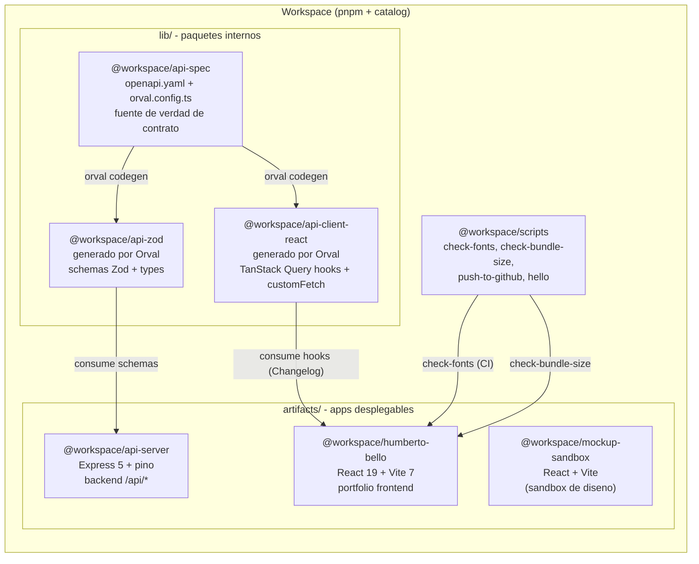
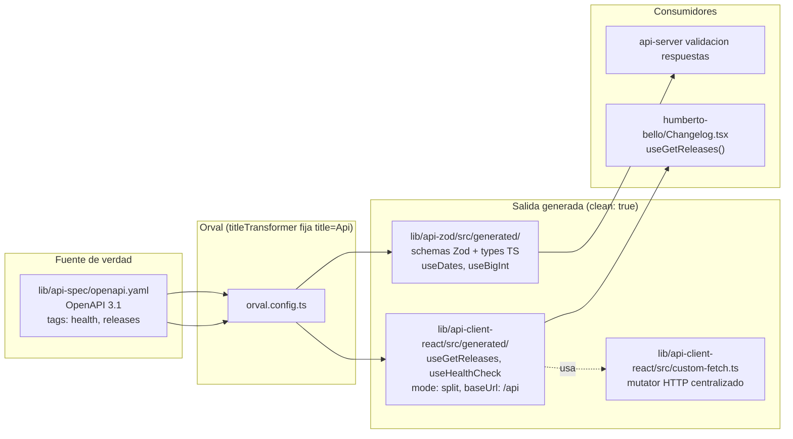
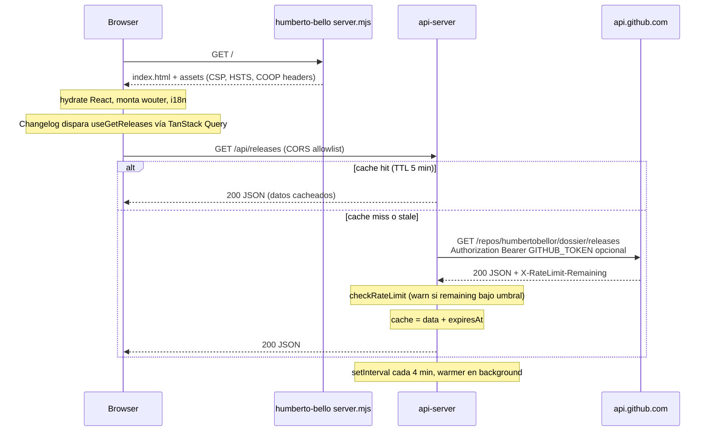
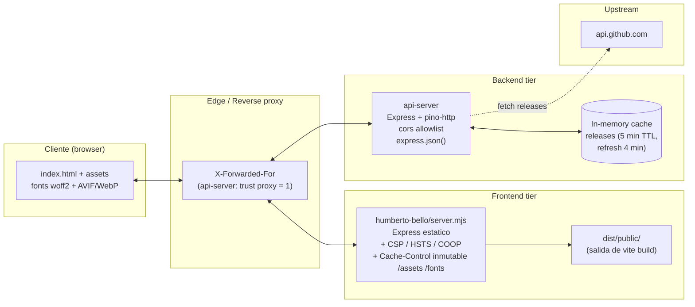
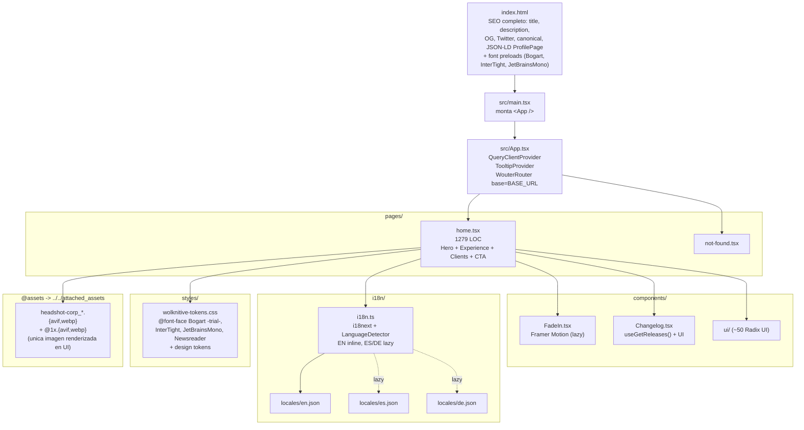
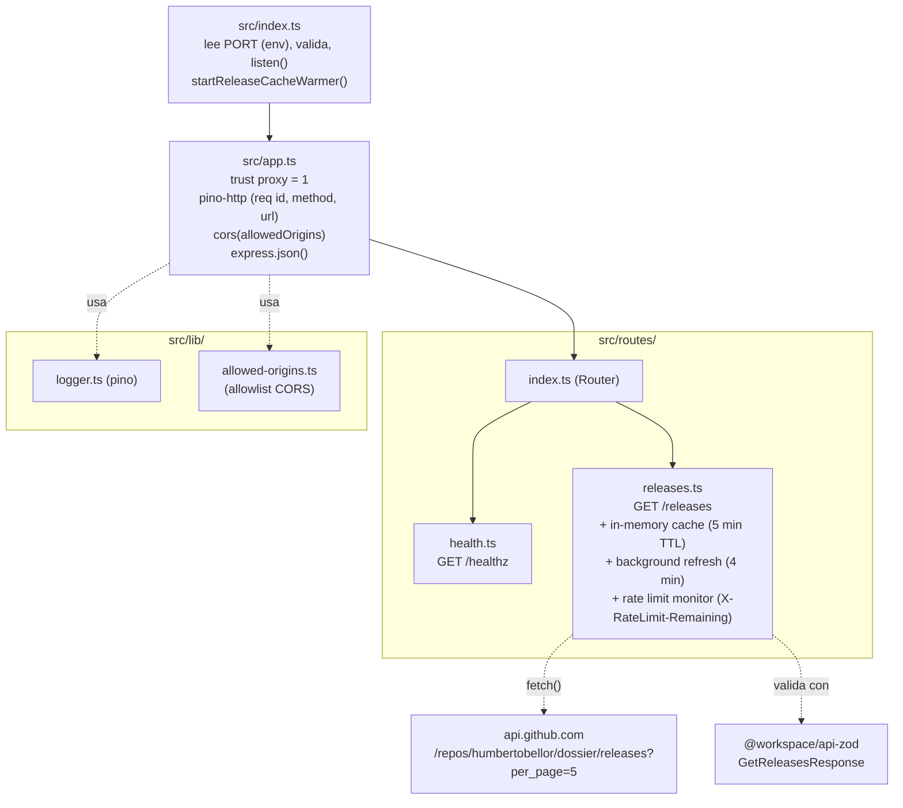
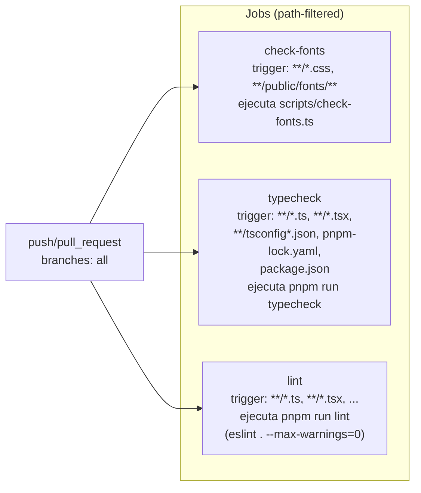
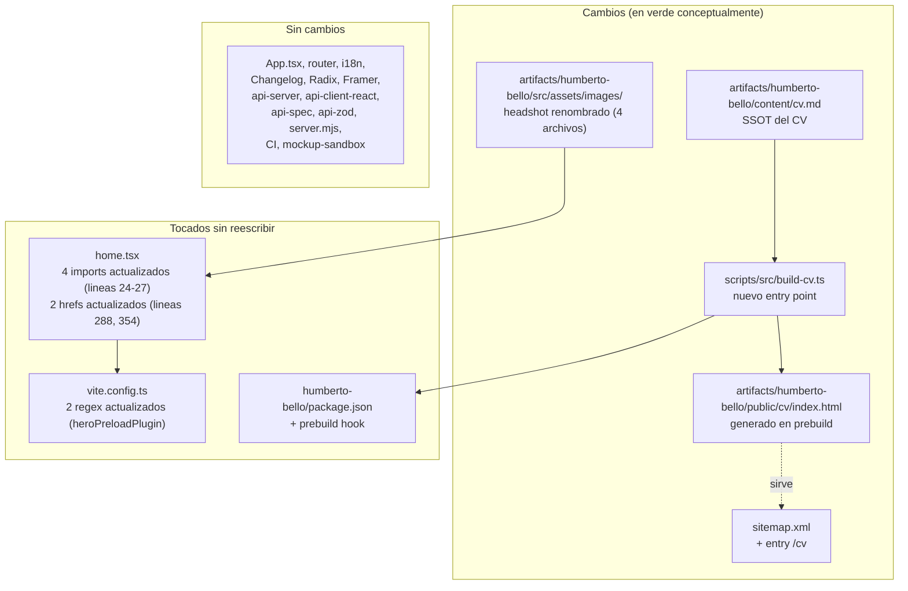

# Architecture — `dossier`

> Documentación del estado actual del repositorio
> [`humbertobellor/dossier`](https://github.com/humbertobellor/dossier) /
> [`Gmrf18/dossier`](https://github.com/Gmrf18/dossier).
> **Esta es la línea base sobre la que se evaluará cualquier migración**;
> mantenerla actualizada en cada fase.

---

## 1. Resumen de alto nivel

`dossier` es el sitio profesional de Humberto "Bert" Bello. A pesar de aparentar
ser un sitio estático de una sola página, internamente es un **monorepo pnpm con
backend propio**: el frontend React consulta un API server en Express que
proxea las releases públicas del repo `humbertobellor/dossier` en GitHub
(con caché en memoria y refresh en background) para alimentar el módulo
"Changelog" del sitio.

Stack resumido:

- **Runtime**: Node 24, pnpm workspaces, TypeScript 5.9
- **Frontend**: React 19 + Vite 7 + Tailwind 4 + Radix UI + Framer Motion + wouter + react-i18next (EN/ES/DE) + TanStack Query
- **Backend**: Express 5 + pino + CORS allowlist + Zod
- **Contrato**: OpenAPI 3.1 → Orval → Zod + TanStack Query hooks (codegen)
- **CI**: GitHub Actions con jobs path-filtered (`check-fonts`, `typecheck`, `lint`)
- **Calidad**: Husky + lint-staged + ESLint 10 + Prettier 3

Filosofía explícita en el repo:
- `Security by Design` — `threat_model.md` con categorías STRIDE.
- **Acciones de CI pineadas a SHA** (no a tags) para evitar supply-chain.
- **Catálogo central de versiones** en `pnpm-workspace.yaml` (`catalog:`).
- `minimumReleaseAge: 1440` (24h) para mitigar paquetes recién publicados.

---

## 2. Monorepo — paquetes

Notas:
- `mockup-sandbox` es un workspace independiente con su propio Radix/Vite —
  está **fuera del scope del módulo `/cv`** y de la migración a Astro
  propuesta, salvo que se decida lo contrario explícitamente.
- `lib/api-zod/src/generated/` y `lib/api-client-react/src/generated/` se
  regeneran con `pnpm --filter @workspace/api-spec run codegen`. **No editar
  a mano** los archivos `generated/`.

---

## 3. Contrato de API y flujo de codegen

Reglas clave:
- `pnpm --filter @workspace/api-spec run codegen` regenera ambos paquetes y
  corre `typecheck:libs` después.
- El título OpenAPI **debe** permanecer como `Api` — el `titleTransformer`
  de Orval lo fuerza y los paths de exportación lo asumen.
- Endpoints actuales: `GET /api/healthz`, `GET /api/releases`.

---

## 4. Runtime — flujo de datos en producción

Implicación importante para cualquier migración:
**el sitio frontend NO es 100% estático** — la sección Changelog requiere un
backend vivo. Migrarlo a SSG puro implica una de tres opciones:

1. **Mantener `api-server` desplegado** y que Astro/cliente lo consuma en
   runtime (igual que hoy). Sigue siendo SSG en el HTML inicial; el fetch
   ocurre tras hidratar.
2. **Build-time fetch**: en cada build, Astro consulta GitHub e inyecta los
   releases en el HTML. Pierde frescura (necesita rebuild para reflejar
   nuevas releases).
3. **Cliente llama a GitHub directo**: elimina `api-server`, pero expone
   rate limit anónimo (60 req/hora/IP) y la lógica de caché desaparece.

---

## 5. Topología de despliegue (estado actual)

Notas:
- Las cabeceras de seguridad las añade **el `server.mjs` del frontend**, no
  el host. Cualquier migración a hosting estático (Netlify/Vercel/Pages)
  debe replicarlas (`_headers`, `vercel.json`, etc.).
- `api-server` no aplica `helmet` ni rate-limit propio en los endpoints
  públicos; solo monitorea el rate limit upstream de GitHub.
- CORS: la allowlist vive en `artifacts/api-server/src/lib/allowed-origins.ts`.

---

## 6. Frontend `humberto-bello` — interior

Pipeline de build (`vite.config.ts`):

| Plugin | Función |
|---|---|
| `@vitejs/plugin-react` | JSX/HMR |
| `@tailwindcss/vite` | Tailwind 4 |
| `runtimeErrorOverlay` | Overlay de errores (Replit) |
| `criticalCssPlugin` | Beasties — inline critical CSS, preload del resto (`swap`) |
| `heroPreloadPlugin` | Inyecta `<link rel="preload" as="image">` para el headshot AVIF con `imagesrcset`/`imagesizes` |
| `bogartPreloadPlugin` | Inyecta `<link rel="preload" as="font">` para Bogart no-italic |
| `cartographer` / `devBanner` | Replit dev only |
| `visualizer` (opcional `ANALYZE=1`) | Bundle stats |
| `manualChunks` | `vendor-react`, `vendor-i18n` |

Servido por `server.mjs` con:
- `/assets` y `/fonts` → `Cache-Control: public, max-age=1y, immutable`
- `*.html` → `Cache-Control: no-store`
- Catch-all `/*` → `index.html` (SPA fallback)
- Headers: CSP, HSTS, COOP, X-Frame-Options=SAMEORIGIN

---

## 7. Backend `api-server` — interior

- Build: `esbuild` con `esbuild-plugin-pino` (bundle CJS hacia `dist/index.mjs`).
- Variables de entorno: `PORT` (obligatoria), `GITHUB_TOKEN` (opcional),
  `GITHUB_RATE_LIMIT_WARN_THRESHOLD` (default 100).
- Sin rate-limit propio en endpoints públicos (es una posible brecha — ver
  `threat_model.md`).

---

## 8. CI — GitHub Actions

Convenciones de CI:
- Cada `uses:` está pineado a SHA de commit, con el tag legible en comentario.
- Setup unificado: `pnpm/action-setup@SHA` v4 (pnpm 10.26.1) + `actions/setup-node@SHA` v4 (Node 24).
- `pnpm install --frozen-lockfile`.
- **No hay job de `build` ni de `test`** en CI hoy — gap a cubrir si se
  añaden gates de Lighthouse/Playwright en la Fase 5 bis del plan.

Hooks locales (Husky):
- `pre-commit`: `lint-staged` con reglas en `.lintstagedrc.mjs`.
- `post-merge`: `scripts/post-merge.sh`.

---

## 9. SEO y assets — inventario auditado

Lo que **sí** se referencia desde código:

| Item | Origen | Uso |
|---|---|---|
| `headshot-corp_*.{avif,webp}` (700w) + `@1x.{avif,webp}` (350w) | `attached_assets/` vía alias `@assets` | 4 imports en `home.tsx` (líneas 24–27); 2 lookups regex en `vite.config.ts` (`heroPreloadPlugin`) |
| `opengraph.jpg` | repo root → copiado a `dist/public` | meta OG + Twitter |
| `favicon.svg` | repo root | `<link rel="icon">` |
| `fonts/*.woff2` | `public/fonts/` | `@font-face` en `wolknitive-tokens.css` + preloads en `index.html` |
| `Humberto_Bello_Resume.pdf` | `public/` | `<a download>` en home (líneas 288, 354) |
| `sitemap.xml` + `robots.txt` | repo root | servidos estáticos |

SEO ya presente en `index.html`:
- `<title>`, `<meta description>`, `<meta keywords>`, `<meta robots>`, `<meta author>`
- `<link rel="canonical">`
- Open Graph completo (type, title, description, url, image+w/h, locale, site_name, profile:first_name/last_name)
- Twitter Card (`summary_large_image`)
- **JSON-LD `ProfilePage`** con `Person` anidado (jobTitle, knowsAbout, hasOccupation, sameAs)

Lo que **no** se referencia y por tanto **no debe procesarse**:
- `attached_assets/*.{pptx,pdf,zip,png,jpeg}` no listados arriba — source
  material (PPTX original, PDFs históricos del CV, ZIP del design system,
  screenshots, fotos varias).

---

## 10. Seguridad — postura actual

| Capa | Mecanismo | Archivo |
|---|---|---|
| Headers HTTP (frontend) | CSP, HSTS, COOP, X-Frame-Options | `artifacts/humberto-bello/server.mjs` |
| CORS (backend) | Allowlist explícita | `artifacts/api-server/src/lib/allowed-origins.ts` |
| Trust proxy | `app.set("trust proxy", 1)` (X-Forwarded-For) | `artifacts/api-server/src/app.ts` |
| Validación de payloads | Zod schemas generados | `lib/api-zod/` |
| Supply chain CI | `uses:` pineados a SHA + `minimumReleaseAge: 1440` | `.github/workflows/ci.yml`, `pnpm-workspace.yaml` |
| Secrets | `GITHUB_TOKEN` opcional vía env | `artifacts/api-server/src/routes/releases.ts` |
| Pre-commit | Husky + lint-staged | `.husky/`, `.lintstagedrc.mjs` |
| Modelo STRIDE | `threat_model.md` (Spoofing/Tampering/Info Disclosure/DoS/EoP) | `threat_model.md` |

Brechas identificables (orthogonales al módulo `/cv`, registradas para
futuro):
- `api-server` **no tiene rate-limit propio** en endpoints públicos
  (`express-rate-limit` está en dependencies pero no se instancia en `app.ts`).
- `CSP` actual permite `'unsafe-inline'` y `'unsafe-eval'` en scripts —
  necesarias para React y los plugins `dev` de Replit; se puede endurecer
  cuando se retiren esos plugins.
- Fuentes Bogart son la versión `-trial`; cualquier despliegue público
  estable debería resolverlo antes.

---

## 11. Arquitectura propuesta — módulo `/cv` (delta sobre el estado actual)

Esta sección documenta los cambios sobre el estado actual (§§1–10) para
implementar el plan de `propuesta_optimizacion.md`. **Decisión
arquitectónica clave**: no se migra el framework. Se añade `/cv` al stack
actual como HTML estático generado en build desde un `cv.md` SSOT.

### 11.1 Cambios resumidos

| Categoría | Estado actual | Estado propuesto |
|---|---|---|
| Ruta `/cv` | No existe (solo PDF estático `Humberto_Bello_Resume.pdf`) | HTML estático servido en `/cv/` desde `dist/public/cv/index.html` |
| Fuente del CV | PPTX original + PDF exportado a mano | `cv.md` (Markdown + frontmatter Zod-validado) en `artifacts/humberto-bello/content/cv.md` |
| Build script | `@workspace/scripts` con `check-fonts`, `check-bundle-size`, `push-to-github`, `hello` | + `build-cv.ts` (unified + remark + rehype → HTML estático) |
| Hook de build | `humberto-bello`: `build` → `vite build` + copia | `humberto-bello`: `prebuild` ejecuta `build-cv.ts` → `vite build` ya copia `public/cv/` |
| Descarga del CV | `<a download="Humberto_Bello_Resume.pdf">` en `home.tsx` líneas 288, 354 | `<a href="/cv">` (PDF se obtiene desde el botón "Imprimir" dentro de `/cv` vía `window.print()`) |
| Asset headshot | `attached_assets/headshot-corp_*.{avif,webp,@1x.*}` vía alias `@assets` | `artifacts/humberto-bello/src/assets/images/humberto-bello-headshot.{avif,webp,@1x.*}` (rename semántico) |
| `sitemap.xml` | Solo `/` | `/` + `/cv` |
| `api-server`, contrato Orval, i18n, Radix, Framer, Changelog, `server.mjs`, CSP/HSTS, vite plugins | — | **Sin cambios** |

### 11.2 Flujo del nuevo módulo `/cv`

```mermaid
flowchart LR
    subgraph Source["Fuente única de verdad"]
        MD["artifacts/humberto-bello/content/cv.md<br/>frontmatter YAML + Markdown<br/>(validado con Zod)"]
    end

    subgraph BuildTime["Build time"]
        BCV["scripts/src/build-cv.ts<br/>@workspace/scripts (tsx)"]
        UNIFIED["unified + remark-parse<br/>+ remark-rehype + rehype-stringify"]
        TPL["plantilla HTML:<br/>head SEO (canonical /cv, OG,<br/>JSON-LD Person+Resume),<br/>@font-face Wolknitive,<br/>style screen + print embebido"]
        BCV --> UNIFIED --> TPL
    end

    subgraph Output["Salida en repo"]
        PUB["artifacts/humberto-bello/public/cv/index.html"]
    end

    subgraph Vite["vite build"]
        DIST["dist/public/cv/index.html<br/>(copia automatica de public/)"]
    end

    subgraph Runtime["Runtime"]
        SRV["server.mjs<br/>Express estatico<br/>(misma CSP/HSTS/COOP que /)"]
        BR["Browser - GET /cv"]
        PRT["window.print() -><br/>PDF generado por el navegador<br/>con print CSS"]
    end

    MD --> BCV
    TPL --> PUB
    PUB --> DIST
    DIST --> SRV
    SRV --> BR
    BR -.boton Descargar.-> PRT
```

### 11.3 Ubicación en el monorepo (delta sobre §2)

### 11.4 Mapeo arquitectura actual → impacto en `/cv`

| Hecho arquitectónico | Implicación para `/cv` |
|---|---|
| Performance ya optimizada (Beasties, hero preload, font preload, manual chunks, AVIF+WebP) — §6 | No tocar `/`. Cualquier cambio en home arriesga regresión sobre un perfil ya bueno |
| `Changelog.tsx` consume `/api/releases` vía Orval/TanStack Query — §4 | Queda intacto. `/cv` es una ruta independiente que no consume API |
| `server.mjs` aplica CSP/HSTS/COOP a todo `/*` — §5, §10 | `/cv/index.html` hereda las mismas cabeceras al servirse desde el mismo Express; cero configuración extra |
| SEO completo en `index.html` con JSON-LD `ProfilePage` — §9 | El `/cv/index.html` reutiliza el bloque SEO (canonical propio = `/cv`) y añade un JSON-LD adicional tipo `CreativeWork`/`Resume` |
| `home.tsx` ya tiene 2 botones de descarga (líneas 288, 354) apuntando a `/Humberto_Bello_Resume.pdf` — §9 | Mantener el PDF estático actual (cambiando luego destino a `/cv` o al PDF regenerado en v2) |
| `attached_assets/` tiene 1 sola imagen referenciada (headshot, 4 archivos: 350w + 700w) — §9 | Renombrado semántico = mover/renombrar 4 archivos + actualizar 4 imports y 2 regex |
| `sharp@^0.34.5` en devDeps del root | Disponible si en v2 se quiere prerender PDF con Playwright (que usa Chromium + posiblemente sharp para post-procesar) |
| `@workspace/scripts` ya existe con tsx + check-fonts + check-bundle-size — §2, §8 | Añadir `scripts/src/build-cv.ts` aquí; encaja con el patrón establecido |
| `mockup-sandbox` es un workspace aparte | Fuera del scope |
| Vite ya copia `public/*` a `dist/public/*` (`server.mjs` lo sirve) | Escribir `artifacts/humberto-bello/public/cv/index.html` desde el build script basta para que `/cv` quede servido en producción |
| CI hoy solo tiene `check-fonts`, `typecheck`, `lint` — §8 | Sumar un job opcional `build-cv-smoke` que ejecute el build script y verifique que `cv/index.html` se genera y valida HTML — pineado a SHA |

---

## 12. Convenciones del repo a respetar

- **Versiones**: usar `catalog:` en `package.json` cuando esté disponible.
- **Codegen**: nunca editar `lib/api-*/src/generated/` a mano.
- **Imports**:
  - `@/` en `humberto-bello` → `src/`
  - `@assets/` en `humberto-bello` → `../../attached_assets/`
- **Estilos**: tokens centralizados en `src/styles/wolknitive-tokens.css`
  (paleta Wolknitive: ink `#14110B`, teal `#1B4E4A`, vellum `#FAF6EC`…).
- **CI**: actions pineadas a SHA, comentario con tag legible.
- **Comentarios en código**: solo el "por qué" no-obvio; no narrar el "qué".
